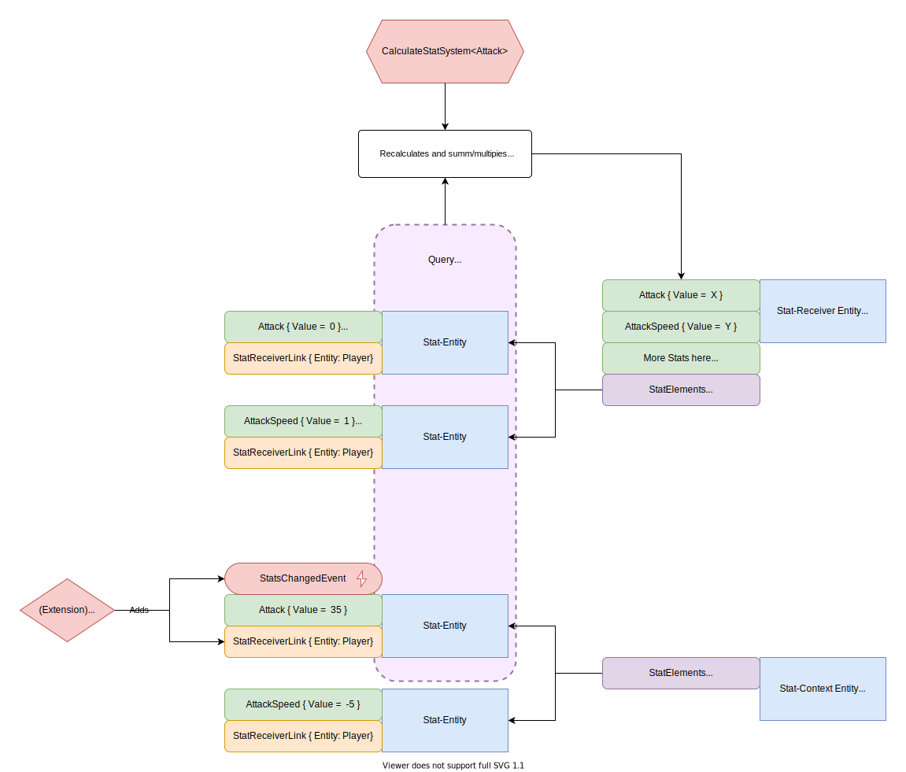

# DOTS-Stats
DOTS-Stats is a high performance and scalable Stats-System.

## Features

- Maximum flexibility. Thanks to the pure component approach, it allows you to implement abilities, items, buffs, potions and make them work together as one single thing.
- High performance. Zero GC allocations.
- 100% ECS-ish. No more complex abstact OOP classes that work here but don't work there.
- Ready-made basic Authoring component for customization in the editor
- Supports *multiplying* and *additive* stats
- The minimum amount of boilerplate code.
- Compatible with burst.
- Compatible with il2cpp.

## HowTo

// In Progress

## How it works under the hood

