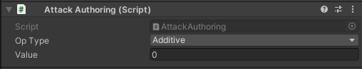

# DOTS-Stats

DOTS-Stats is a high performance and scalable Stats-System.

# Features

- Maximum flexibility. Thanks to the pure component approach, it allows you to implement abilities, items, buffs, potions and make them work together as one single thing.
- High performance. Zero GC allocations.
- 100% ECS-ish. No more complex abstact OOP classes that work here but don't work there.
- Ready-made base Authoring components for customization in the editor
- Supports *multiplying* and *additive* stats
- The minimum amount of boilerplate code.
- Compatible with burst.
- Compatible with il2cpp.

# HowTo

## Requirements

`Min. Requirements:` Unity >= 2019.4.18 and entities package >= 0.11.2-preview.1

`Tested on:` Unity 2020.2.3 and entities package 0.17.0-preview.42

## Installation

You can install the repository using `UPM`:
Just add this line in Packages/manifest.json:

"com.nanory.unity.entities.stats": "https://github.com/SinyavtsevIlya/DOTS-Stats.git",

## Usage
Let's say you want to create an RPG'like stats system. 
When the player takes a weapon, his Attack stat grows. When he drops it, the stat returns to default.

### 1) Create a new Stat component you need

``` c#
public struct Attack : IComponentData
{
    // The only constraint is you must have a float field. 
    public float Value; 
}
```

### 2) Create an Authoring for this Stat

``` c#
public class AttackAuthoring : StatAuthoringBase<Attack>
{
    [SerializeField] float _value;
    // Simply return a new instance of "Attack" and set it's value from the serialized field. 
    protected override Attack GetStat() => new Attack() { Value = _value };
}
```
You'll get this:



### 3) Create two gameobject in your scene: "Sword" and "Player". Add an `AttackAuthoring` on both of them.
And also add a `StatReceiverTagAuthoring` on the Player gameobject, to make him a "Stat-Reciever". (means that he able to accumulate stats from other contexts, e.g. items, buffs etc.)
> Don't forget to add a `ConvertToEntity` on them to enable automatic conversion in a scene.

### 4) And add the test code that triggers sword equipement 

```csharp
// anywhere you want. Say on spacebar hit:
EntityManager.SetStatsChanged(swordEntity, playerEntity);

// and call this to deequip:
EntityManager.SetStatsRemoved(swordEntity);
```

### 5) And finally to make things work, add this system declaration somewhere

```csharp
    [UpdateInGroup(typeof(StatSystemGroup))]
    public class CalculateAttackSystem : CalculateStatSystem<Attack> { }
```

> You also able to add a system in a shorter way:
> 
>   `DefaultWorldInitialization.AddSystemsToRootLevelSystemGroups(_world, typeof(CalculateStatSystem<Attack>))` 
>   
> This step is recomended to be automated (code-gen, code-snippets, build processors or whatever you like) 

Thats it! 

# FAQ

## Ok. Does it work with Jobs/Burst?

Sure. Just use `EnityCommandBuffer` versions of extension methods:

```csharp
entityCommandBuffer.SetStatsChanged(contextEntity, statReceiverEntity);
entityCommandBuffer.SetStatsRemoved(contextEntity);
```

## How to react on Stat change on a stat-receiver-entity?

Just add a `StatRecievedElementEvent` component in your querry. 
Here is an example:
```csharp
 Entities
    .ForEach((Entity ownerEntity, DynamicBuffer <StatRecievedElementEvent> statRecievedEvents, StatsWidget widget) =>
    {
        for (var idx = 0; idx < statRecievedEvents.Length; idx++)
        {
            var statRecievedEvent = statRecievedEvents[idx];

            if (statRecievedEvent.Is<Attack>())
                widget.SetAttack(EntityManager.GetComponentData<Attack>(ownerEntity).Value);

            if (statRecievedEvent.Is<AttackSpeed>())
                widget.SetAttackSpeed(EntityManager.GetComponentData<AttackSpeed>(ownerEntity).Value);
                
            // more stats here...
        }
    });
```

> Since several stats can change at once during one frame, the event is presented as a `DynamicBuffer` of structs that clears automatically in the end of frame. 

# How it works under the hood


